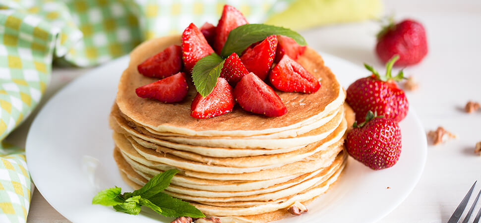

# Odev-3

<!DOCTYPE html>
<html lang="tr">
<head>
    <meta charset="UTF-8">
    <meta http-equiv="X-UA-Compatible" content="IE=edge">
    <meta name="viewport" content="width=device-width, initial-scale=1.0">
</head>
<body style="background-color: #FDEEDC" >
    <!-- Content - Start -->
    <section style = "font-family:system-ui, -apple-system, BlinkMacSystemFont, 'Segoe UI', Roboto, Oxygen, Ubuntu, Cantarell, 'Open Sans', 'Helvetica Neue', sans-serif">
        <!-- Article - Start -->
        <h1 style="color: #FF5D5D"> Pancake (Pankek) Tarifi </h1>
        <article>
            
            
 <strong> Kaç Kişilik : </strong> 4 kişilik

            
 <strong> Hazırlama Süresi : </strong> 20 dakika

            
 <strong> Pişirme Süresi : </strong> 20 dakika
 

        </article>
        <article>
            <h2 style="color: #FF5D5D"> Pancake (Pankek) hamuru için: </h2>
            <ul>
                <li> 2 adet yumurta </li>
                <li> 1/2 su bardağı toz şeker </li>
                <li> 2 su bardağı un</li>
                <li> 1,5 su bardağı süt</li>
                <li> 2 yemek kaşığı ayçiçek yağı</li>
                <li> 1 paket kabartma tozu</li>
                <li> 1 paket vanilin </li>
                <li> 1 tutam tuz </li>
            </ul> 
 
        </article>
        <article>
            <iframe width="885" height="498" src="https://www.youtube.com/embed/16iwweBUPlo" title="PANKEK TARİFİ | NASIL YAPILIR?" frameborder="0" allow="accelerometer; autoplay; clipboard-write; encrypted-media; gyroscope; picture-in-picture" allowfullscreen></iframe>
        </article>

        <article>
            <h2 style="color: #FF5D5D"> Pancake (Pankek) Tarifi Nasıl Yapılır? </h2>
            <ol>
                <li> Derin bir karıştırma kabında 2 yumurta ve yarım su bardağı şekeri alın.</li>
                <li> Şeker eriyene ve karışım krema kıvamını alana kadar çırpın.</li>
                <li> Yumurtalı karışımın üzerine, 2 yemek kaşığı sıvı yağ ve 1,5 su bardağı sütü de koyup tekrar çırpın.</li>
                <li> 2 su bardağı un, 1 paket kabartma tozu, 1 paket vanilin ve bir tutam tuzu da eleyerek karışımın içerisine ekleyin.</li>
                <li> Pürüzsüz bir kıvam alana kadar çırpın.</li>
                <li> İlk pankeki pişirmek için; krep tavasını ayçiçek yağı ile yağlayın. Kızdırdığınız tavaya küçük bir kepçe ya da bir kahve fincanı kadar pankek harcını aktarın.</li>
                <li> Ocağın altını kısın. Pankeki, üzeri göz göz olana kadar pişirin. Bir spatula yardımıyla çevirdiğiniz pankekin diğer tarafını da aynı şekilde pişirin.</li>
                <li> Krep tavasını arada yağlayarak pankek harcı bitene kadar aynı işlemi tekrarlayın.</li>
                <li> Servis tabağına aldığınız pankeklerin üzerine tereyağı koyup bal gezdirebilirsiniz, afiyet olsun.</li>
            </ol> 

        </article>

        <article>
            <h2 style="color: #FF5D5D"> Pancake (Pankek) Tarifinin Servis Önerisi</h2>
            
 Arzuya göre; reçel, akçaağaç şurubu, mevsim meyveleri hatta dondurma ve tarçınla servis edebilirsiniz. 

        </article>
        <!-- Article - End -->
    </section>
    <!-- Content - End  -->
</body>
</html>
